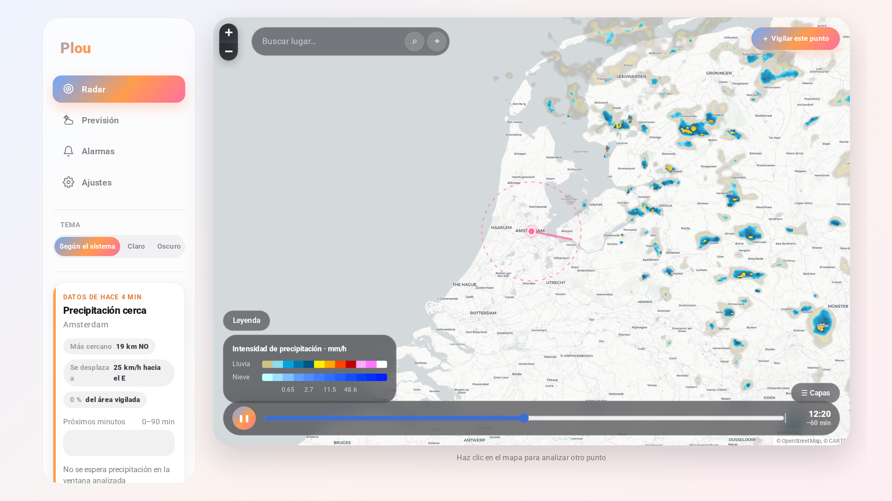

# Plou

Avisos de lluvia basados en radar meteorológico y previsión detallada, en una
aplicación web instalable (PWA).

Plou vigila las ubicaciones que le indiques, analiza los mosaicos de radar en
tiempo real y te avisa **antes** de que la precipitación llegue, calculando hacia
dónde se mueve el sistema y cuánto tardará. Cuando no llueve, funciona como una
app de previsión completa: condiciones actuales, precipitación en pasos de 15
minutos, previsión horaria de 48 h y diaria de hasta 16 días.



---

## Qué hace

### Alarma de lluvia por radar

- **Vigilancia de varias ubicaciones**, cada una con su propia configuración.
- **Radio ajustable** de 1 a 100 km alrededor de cada punto.
- **Sensibilidad** en cinco niveles (llovizna, lluvia débil, moderada, fuerte,
  tormenta), traducidos a umbrales de reflectividad en dBZ.
- **Detección separada de lluvia y nieve**: se pueden activar por separado.
- **Tres modos de aviso**:
  - *Sólo cuando llueva encima*: el aviso llega al empezar a llover en el punto.
  - *Cuando haya lluvia en el radio*: en cuanto el radar detecta precipitación
    dentro del círculo vigilado.
  - *Cuando se acerque lluvia*: extrapola el desplazamiento observado del radar
    y avisa con la antelación que elijas (5–120 min).
- **Velocidad mínima del sistema** para no avisar por chubascos estacionarios.
- **Repetición** del aviso mientras dura la situación, con intervalo propio.
- **Silencio mínimo** entre avisos distintos.
- **Aviso de fin de lluvia** opcional.
- **Posponer** (snooze) con duración configurable, también desde la propia
  notificación.
- **Horas de silencio** y **franja de vigilancia**, ambas con selección de días
  de la semana y soporte de franjas que cruzan la medianoche.
- **Sonido de alarma** sintetizado: ocho tonos, volumen, duración, repetición
  hasta descartar, subida gradual de volumen y vibración.
- **Historial de avisos** con lo que se detectó en cada uno.
- **Ubicación que sigue al dispositivo**: se actualiza con tu posición.

### Radar

- Animación de las últimas 2 horas (13 fotogramas, uno cada 10 min), con la
  barra de tiempo marcando el «ahora». El intervalo se elige desde el mapa:
  30 min, 1 h o 2 h, y la velocidad entre lenta, normal y rápida.
- Cuando el proveedor publica fotogramas extrapolados al futuro, se añaden al
  final de la animación y se pueden desactivar. No siempre los publica: si no
  hay, el panel lo dice en vez de ofrecer un interruptor que no hace nada.
- Panel de capas sobre el propio mapa: opacidad, aspecto (colores nítidos de la
  paleta o integrados con el mapa base), escala de color, suavizado, nieve y
  zona sin cobertura.
- Nueve escalas de color, con leyenda de intensidad tomada de la propia paleta:
  los colores de la leyenda no pueden desajustarse de los del mapa.
- Mapas base claro, oscuro, callejero y topográfico, más el modo automático que
  sigue al tema. Los topónimos se dibujan por encima del radar para no perder
  las referencias cuando la lluvia cubre la zona.
- Círculo de vigilancia y flecha de desplazamiento del sistema.
- Buscador de localidades sobre el mapa y botón para vigilar el punto elegido.
- Toca cualquier punto del mapa para analizarlo al momento. Si no hay ecos en la
  zona se dice de forma explícita, para no confundir la calma con una avería.

### Previsión

- Condiciones actuales: temperatura, sensación, humedad, viento y rachas,
  presión, nubosidad, visibilidad, índice UV y punto de rocío.
- Precipitación prevista en pasos de 15 minutos para las próximas 6 horas.
- Previsión horaria de 48 h y diaria de hasta 16 días, con detalle por día.
- Amanecer, atardecer, horas de luz y de sol.

### Aspecto

- Sistema de diseño propio: Material 3 con un degradado de atardecer
  (azul → naranja → rosa) como firma. Un único elemento por vista lleva el
  degradado —la acción principal o el estado activo—; el resto son superficies
  neutras que dependen del tema.
- Tema claro y oscuro conviviendo, con todos los colores en variables CSS.
- Formas redondeadas: tarjetas de 24 px, controles en cápsula, iconos lineales
  dibujados a mano con `stroke="currentColor"`.
- Tipografía Roboto servida desde la propia aplicación, de modo que la PWA
  conserva su aspecto sin conexión y sin pedir nada a terceros.
- En escritorio, barra lateral fija con la navegación y el contexto de la vista;
  el mapa ocupa el panel principal entero. En móvil, switcher inferior en
  cápsula flotante y mapa a sangre con los controles en cristal por encima.

### Ajustes

- Tres idiomas: castellano, catalán e inglés.
- Tema claro, oscuro o según el sistema.
- Unidades independientes para temperatura (°C/°F), viento (km/h, m/s, mph, kn,
  Beaufort), precipitación (mm/in), distancia (km/mi), presión (hPa, inHg, mmHg)
  y formato horario (24 h / 12 h).
- Intervalo de refresco, ahorro de energía y pantalla siempre encendida.

---

## Cómo funciona por dentro

La parte interesante es cómo se obtiene la información de lluvia: el servidor no
usa una API de "¿va a llover?", sino que **lee directamente los mosaicos de
radar**.

1. **Descarga de teselas.** Para cada ubicación vigilada se piden las teselas PNG
   del radar que cubren la zona, sin suavizado y con la capa de nieve visible.
2. **Decodificación exacta.** Cada píxel se traduce a reflectividad (dBZ) y a
   tipo de precipitación mediante la tabla de colores oficial del proveedor,
   incorporada al código en `server/src/radar/colorTable.generated.ts`. Sobre
   datos reales, el 100 % de los píxeles con eco coincide de forma exacta con la
   paleta (compruébalo con `npx tsx scripts/check-radar.mts`).
3. **Rejilla local en kilómetros.** Los píxeles se proyectan a una rejilla
   centrada en la ubicación con celdas de tamaño fijo en km, tomando el máximo de
   los píxeles que cubre cada celda para no perder núcleos pequeños.
4. **Desplazamiento del sistema.** Se correlacionan fotogramas consecutivos
   (mínimo error cuadrático con refinado subcelda) para obtener la velocidad del
   campo de precipitación en km/h, combinando varios pares con la mediana.
5. **Extrapolación.** Con persistencia lagrangiana, el valor futuro en un punto
   `P` en el instante `t` es el valor actual en `P − v·t`. De ahí salen el tiempo
   de llegada, el tiempo hasta que escampa y la evolución prevista.
6. **Decisión de alarma.** Una función pura compara la situación con la
   configuración y el estado anterior, y decide si avisar, silenciar o cerrar la
   situación.

La previsión numérica (temperaturas, viento, días siguientes) sí viene de una API
de previsión, y es independiente del radar.

---

## Puesta en marcha

Requisitos: Node.js 20 o superior.

```bash
npm install                # instala servidor y app web
npm run keys               # genera las claves VAPID para los avisos push
npm run build              # compila el servidor y la PWA
npm start                  # sirve todo en http://localhost:8787
```

Para desarrollo, con recarga en caliente:

```bash
npm run dev                # API en :8787 y Vite en :5173 con proxy a la API
```

### Avisos push y HTTPS

Los avisos push del navegador **exigen un origen seguro**. `localhost` cuenta
como seguro, así que en local funcionan sin más. Para usarlo desde el móvil hace
falta HTTPS; lo más rápido es un túnel:

```bash
pinggy 8787
```

y abrir la URL `https://…` que devuelve.

Las claves VAPID se guardan en `server/data/vapid.json` con permisos `600`. Si
las regeneras, todas las suscripciones existentes dejan de ser válidas.

### Docker

```bash
docker compose up -d
```

Los datos persistentes (base de datos SQLite y claves) quedan en el volumen
montado en `/app/server/data`.

---

## Configuración

Todo se ajusta por variables de entorno; ninguna es obligatoria.

| Variable | Por defecto | Para qué sirve |
| --- | --- | --- |
| `PORT` | `8787` | Puerto de escucha |
| `HOST` | `0.0.0.0` | Interfaz de escucha |
| `PLOU_DATA_DIR` | `./data` | Carpeta de datos persistentes |
| `PLOU_DB` | `$PLOU_DATA_DIR/plou.db` | Ruta de la base de datos |
| `PLOU_SERVE_WEB` | `true` | Servir la PWA compilada desde el propio servidor |
| `PLOU_WEB_DIST` | `../web/dist` | Carpeta del build de la PWA |
| `PLOU_ALARM_ENABLED` | `true` | Activar el bucle de vigilancia |
| `PLOU_ALARM_TICK` | `120` | Segundos entre ciclos de vigilancia |
| `PLOU_ALARM_MAX_FRAME_AGE` | `30` | Minutos: si el radar va más retrasado, no se evalúa |
| `PLOU_RADAR_ZOOM` | `7` | Zoom de las teselas de análisis |
| `PLOU_RADAR_TILE_CACHE` | `400` | Teselas decodificadas en memoria |
| `PLOU_FORECAST_TTL` | `600` | Segundos de caché de la previsión |
| `PLOU_VAPID_SUBJECT` | `mailto:admin@localhost` | Contacto para el servicio de push |
| `PLOU_VAPID_PUBLIC_KEY` / `PLOU_VAPID_PRIVATE_KEY` | del fichero | Claves push por entorno |

Ver `.env.example` para la lista completa, incluidas las de Foreca.

---

## Fuentes de datos

| Dato | Fuente | Condiciones |
| --- | --- | --- |
| Mosaicos de radar | [RainViewer](https://www.rainviewer.com/api.html) | Acceso libre para uso personal y educativo; pide que se cite la fuente. Sin garantía de disponibilidad. |
| Previsión numérica | [Open-Meteo](https://open-meteo.com/) | Gratuita y sin clave para uso no comercial (CC BY 4.0). |
| Búsqueda de localidades | [Open-Meteo Geocoding](https://open-meteo.com/en/docs/geocoding-api) | Igual que la anterior. |
| Nombre de la posición actual | [BigDataCloud](https://www.bigdatacloud.com/) | Punto de acceso gratuito sin clave. |
| Mapas base | OpenStreetMap, CARTO, OpenTopoMap | Requieren la atribución que ya muestra el mapa. |

La aplicación muestra las atribuciones en la pantalla de ajustes. Si la vas a
usar con tráfico alto o con fines comerciales, revisa las condiciones de cada
proveedor: el nivel gratuito de RainViewer está pensado para uso personal.

### ¿Y Foreca?

Foreca tiene buena reputación como modelo de previsión, pero **no es de uso
libre**: es un servicio comercial bajo licencia anual. Lo que hay disponible sin
pagar es:

- una **prueba gratuita** de 30 días con 2.000 peticiones/día en
  [developer.foreca.com](https://developer.foreca.com/);
- un plan **Basic a 0 €/mes** en RapidAPI con 1.000 peticiones/día y un límite de
  ancho de banda.

Ninguna de las dos sirve para un servicio permanente, así que Foreca está
integrado como **proveedor opcional**: el código está listo, pero permanece
desactivado mientras no aportes credenciales propias. Si las configuras, aparece
como opción seleccionable en la pestaña de previsión; si no, la app usa
Open-Meteo, que sí es gratuito y no requiere clave.

```bash
# Acceso directo (usuario y contraseña de developer.foreca.com)
PLOU_FORECA_MODE=direct
PLOU_FORECA_USER=tu-usuario
PLOU_FORECA_PASSWORD=tu-contraseña

# O bien a través de RapidAPI
PLOU_FORECA_MODE=rapidapi
PLOU_FORECA_RAPIDAPI_KEY=tu-clave
```

> El cliente de Foreca sigue las rutas documentadas (`/authorize/token`,
> `/api/v1/current/…`, `/api/v1/forecast/{15minutely,hourly,daily}/…`) y lee los
> campos de la respuesta de forma defensiva, pero **no se ha podido probar contra
> el servicio real** por no disponer de credenciales. Si lo activas y algún campo
> no encaja, el ajuste está localizado en `server/src/forecast/foreca.ts`.

Conviene saber que el radar —que es lo que dispara las alarmas— no depende del
proveedor de previsión: cambiar de Open-Meteo a Foreca sólo afecta a las
temperaturas y a los días siguientes.

---

## Estructura del proyecto

```
server/
  src/
    radar/         lectura y análisis de los mosaicos de radar
      colorTable   tabla de colores → dBZ y tipo de precipitación
      tiles        descarga y decodificación de teselas, con caché
      field        rejilla local en kilómetros
      motion       estimación del desplazamiento por correlación cruzada
      analysis     qué llueve, dónde, cuándo llega y cuándo escampa
      coverage     dónde hay (y no hay) cobertura de radar
    alarm/
      engine       decisión de aviso (función pura, muy probada)
      window       horas de silencio y franjas de vigilancia
      watcher      bucle de vigilancia en segundo plano
    forecast/      proveedores de previsión (Open-Meteo, Foreca) y geocodificación
    routes/        API HTTP
    db.ts          SQLite con migraciones
  scripts/
    check-radar    diagnóstico del canal de radar sobre datos reales
    verify-motion  verificación del vector de desplazamiento
  test/            pruebas unitarias (vitest)
web/
  src/
    components/    mapa de radar, previsión, alarmas y ajustes
    lib/audio      síntesis de los tonos de alarma con la Web Audio API
    lib/push       registro del service worker y suscripción push
  public/sw.js     service worker: avisos push y caché del armazón
scripts/
  gen-color-table  regenera la tabla de colores desde el CSV del proveedor
  gen-icons        genera los iconos de la aplicación
```

---

## API

Las rutas privadas se identifican con la cabecera `x-device-id`, un
identificador opaco que genera el propio navegador. No hay cuentas de usuario ni
datos personales: el dispositivo es la identidad.

| Método y ruta | Para qué |
| --- | --- |
| `GET /api/meta` | Tablas, proveedores, clave push y valores por defecto |
| `GET /api/status` | Estado del vigilante y de la caché |
| `POST /api/device` | Alta o latido del dispositivo |
| `GET`/`PUT` `/api/settings` | Preferencias del dispositivo |
| `GET`/`POST` `/api/locations` | Listar y crear ubicaciones |
| `PATCH`/`DELETE` `/api/locations/:id` | Modificar y borrar |
| `POST /api/locations/:id/position` | Actualizar la posición del dispositivo |
| `POST /api/locations/:id/snooze` | Posponer los avisos |
| `POST /api/locations/:id/dismiss` | Cerrar la situación activa |
| `POST /api/locations/:id/check` | Forzar una comprobación |
| `POST /api/locations/:id/test` | Enviar una notificación de prueba |
| `GET /api/locations/:id/analysis` | Análisis con la configuración de la ubicación |
| `GET /api/radar/frames` | Fotogramas y plantillas de tesela para el mapa |
| `GET /api/radar/legend` | Escalones de color de una escala, leídos de la paleta |
| `GET /api/radar/analysis` | Análisis de un punto arbitrario |
| `GET /api/forecast` | Previsión normalizada |
| `GET /api/geocode`, `/api/geocode/reverse` | Búsqueda de localidades |
| `GET /api/events` | Historial de avisos |
| `POST /api/push/subscribe`, `/unsubscribe` | Suscripción a los avisos |

---

## Desarrollo

```bash
npm test                                    # 105 pruebas unitarias
npm run typecheck --workspace=@plou/server
npx tsx server/scripts/check-radar.mts      # diagnóstico sobre datos reales
npx tsx server/scripts/verify-motion.mts    # verifica el vector de movimiento
node scripts/gen-color-table.mjs            # regenera la tabla de colores
node scripts/gen-icons.mjs                  # regenera los iconos
```

Las pruebas cubren la decodificación de color, la geometría, la estimación de
movimiento, las franjas horarias, la lógica de decisión de alarmas, la
persistencia y la normalización de la previsión. `verify-motion` va más allá:
toma un fotograma de radar real, lo desplaza una cantidad conocida y comprueba
que la correlación recupera ese desplazamiento en magnitud y signo.

---

## Límites conocidos

- La cobertura de radar no es universal. Fuera de ella la app lo indica y se
  apoya en la previsión numérica, que no permite avisar con la misma precisión.
- El nivel de acceso gratuito al radar no incluye los fotogramas de
  extrapolación del proveedor; Plou calcula los suyos a partir del movimiento
  observado, que es fiable para sistemas organizados y menos para tormentas
  aisladas que se forman y disipan sobre el terreno.
- El índice del proveedor tiene un apartado de satélite (nubosidad infrarroja),
  pero en el acceso gratuito llega vacío, así que no hay capa de nubes: el mapa
  muestra precipitación detectada por radar, no nubes.
- La extrapolación asume que la precipitación se traslada sin cambiar: no prevé
  que un chubasco se intensifique o se deshaga.
- Los avisos push dependen del navegador. En iOS hay que instalar la app en la
  pantalla de inicio para que funcionen.

---

## Licencia

[MIT](LICENSE). Puedes usar, modificar y redistribuir el código citando la
autoría.

Dos matices sobre material de terceros incluido en el repositorio:

- `scripts/rainviewer_colors.csv` es la tabla de colores publicada por
  RainViewer, no obra de este proyecto (ver
  [su origen](scripts/rainviewer_colors.ORIGEN.md)).
- La tipografía de `web/public/fonts/` es Roboto, de Google, bajo Apache 2.0.

Que el código sea libre no hace libre el servicio: los proveedores de datos
tienen sus propias condiciones —el nivel gratuito de RainViewer es para uso
personal y Open-Meteo es CC BY 4.0 no comercial—. Revísalas antes de darle un
uso comercial.
